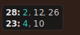
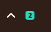

# Transportation Overlay

Маленькое Windows-приложение, чтобы не пропустить момент выхода с работы на транспорт.

Оно живет в трее, вечером проверяет live-прогноз Яндекс Карт для нужной остановки и показывает компактный оверлей в углу экрана. Смысл не в полноценном расписании, а в короткой подсказке: выходить сейчас или можно еще спокойно досидеть.



В трее дополнительно видно число минут до ближайшего автобуса:



## Что умеет

- показывает выбранные маршруты и ближайшие прибытия в минутах;
- обновляет данные по таймеру;
- работает только в заданный вечерний период, если включено расписание;
- показывает подробности в tooltip трея;
- не превращает частотные интервалы Яндекса вроде "каждые 8 минут" в фейковые прибытия.

## Запуск

```powershell
uv sync
uv run python main.py
```

## Сборка exe

Для локальной сборки Windows-исполняемого файла нужен Python 3.11+.

```powershell
.\build.ps1
```

Скрипт установит зависимости проекта и `PyInstaller`, затем соберет приложение в:

```text
dist\TransportationOverlay.exe
```

Если нужен вариант папкой, а не одним большим exe:

```powershell
.\build.ps1 -OneDir
```

После сборки рядом с exe можно положить свой `config.toml`. При запуске приложение сначала ищет конфиг в текущей папке, затем рядом с exe. Если внешний конфиг не найден, используется `config.toml`, упакованный в сборку.

## Автосборка на GitHub

В репозитории есть workflow `.github/workflows/release.yml`. Он собирает Windows x64 exe и публикует его в GitHub Release.

Автоматический релиз запускается при пуше тега вида `v0.1.0`:

```powershell
git tag v0.1.0
git push origin v0.1.0
```

Также сборку можно запустить вручную в GitHub Actions через `workflow_dispatch`, указав тег, например `v0.1.0`.

## Настройка

Основное лежит в `config.toml`:

```toml
[app]
title = "Транспорт домой"

[schedule]
enabled = true
active_from = "18:30"
active_to = "21:00"
poll_seconds = 30
inactive_check_seconds = 300

[yandex]
stop_ids = ["1543190229", "stop__1543190229"]
routes = ["23", "28"]
arrivals_per_route = 3
```

`enabled = true` включает автоматические триггеры: в `active_from` отслеживание включается, в `active_to` выключается. Между этими триггерами состояние можно менять вручную.

`poll_seconds` лучше не делать слишком маленьким: частые запросы могут привести к ограничениям или капче со стороны Яндекса.

## Управление

- одиночный клик по иконке в трее переключает отслеживание в любом состоянии;
- правый клик открывает меню с тем же переключателем и выходом;
- tooltip трея показывает все маршруты и время последнего обновления.

## Данные

Приложение использует live-события прибытия из ответа Яндекса (`Estimated` / `Scheduled`). Если реальных событий для маршрута нет, приложение показывает отсутствие данных, а не красиво выглядящие, но сомнительные числа.
